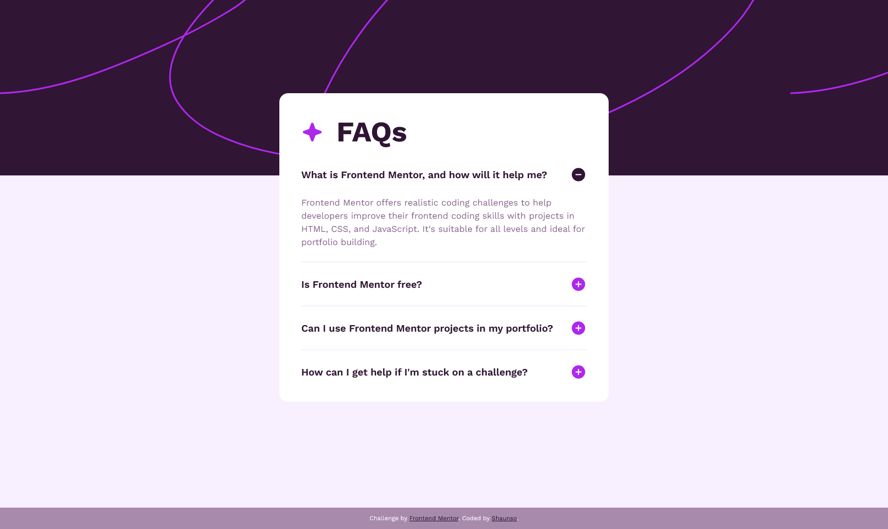

# Frontend Mentor - FAQ accordion solution

This is a solution to the [FAQ accordion challenge on Frontend Mentor](https://www.frontendmentor.io/challenges/faq-accordion-wyfFdeBwBz).

## Table of contents

- [Overview](#overview)
  - [The challenge](#the-challenge)
  - [Screenshot](#screenshot)
  - [Links](#links)
- [My process](#my-process)
  - [Built with](#built-with)
  - [What I learned](#what-i-learned)
  - [Continued development](#continued-development)
  - [Useful resources](#useful-resources)
- [Author](#author)

## Overview

### The challenge

Users are able to:

- Hide/Show the answer to a question when the question is clicked
- Navigate the questions and hide/show answers using keyboard navigation alone
- View the optimal layout for the interface depending on their device's screen size
- See hover and focus states for all interactive elements on the page

### Screenshot

[Desktop preview of my solution to the challenge](./desktop_solution.png)
[Mobile preview of my solution to the challenge](./mobile_solution.png)

### Links

- Solution URL: (https://github.com/shaunso/front_end_mentor_faq_accordion.git)
- Live Site URL: (https://shaunso.github.io/front_end_mentor_faq_accordion/)

## My process

### Built with

- HTML5
- CSS custom properties
- Vanilla JavaScript
- Flexbox
- Mobile-first workflow

### What I learned

- @keyframes & animations
- the horizontal rule element
- .addEventListener
- using 'position: fixed' to add a footer to the page
- the '<button>' element and not '
' element is used to enable keyboard navigation of a web page; which in turn makes the element interactive including for focus states
- solidified my understanding of media queries
- '.classList.toggle'

### Continued development

- 'keydown' & 'keyup' event listeners
- '.classList'

## Author

- Frontend Mentor - [@shaunso](https://www.frontendmentor.io/profile/shaunso)